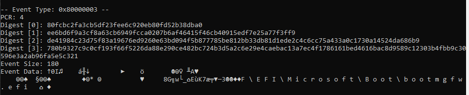
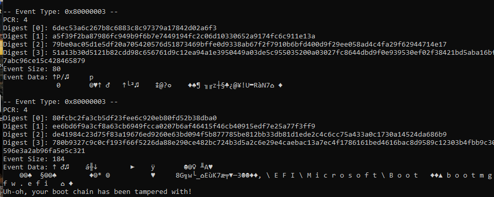
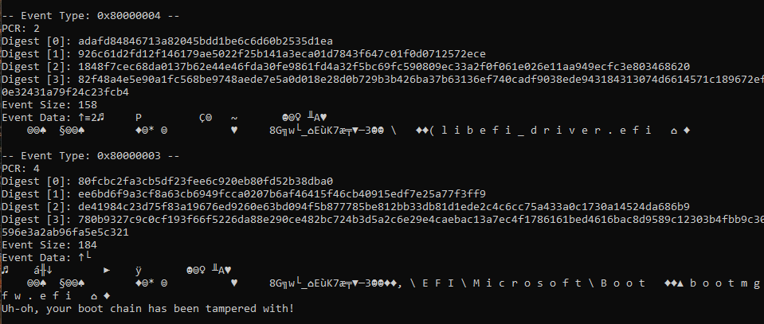

# Leveraging TPM2 TCG Logs (Measured Boot) to Detect UEFI Drivers and Pre-Boot Applications

This project demonstrates how to use TPM2 TCG Event Logs (Measured Boot) to detect potential tampering in the Windows boot chain from User Mode. It identifies UEFI drivers and applications that execute before Windows even boots and shows how to extract their cryptographic hashes. There's also a small feature included that detects potential boot chain tampering.

I know this isn’t groundbreaking, but I created this simple project as part of my research into Measured Boot. I couldn’t find many good resources on the topic, so I decided to make my own proof of concept. The code isn’t high quality by any means, it’s mostly for learning purposes, but I’m releasing it in case others find it useful or interesting.

## Showcase

### Booting Without Interference

### Launching the EFI Shell Before Bootloader Initialization

### Loading a EFI driver Before Booting Windows

## Resources
- https://trustedcomputinggroup.org/wp-content/uploads/TSS_Overview_Common_v1_r10_pub09232021.pdf
- https://github.com/tpm2-software/tpm2-tools
- https://learn.microsoft.com/en-us/troubleshoot/windows-client/windows-security/decode-measured-boot-logs-to-track-pcr-changes
- https://trustedcomputinggroup.org/wp-content/uploads/TCG-PC-Client-Platform-Firmware-Profile-Version-1.06-Revision-52_pub-3.pdf